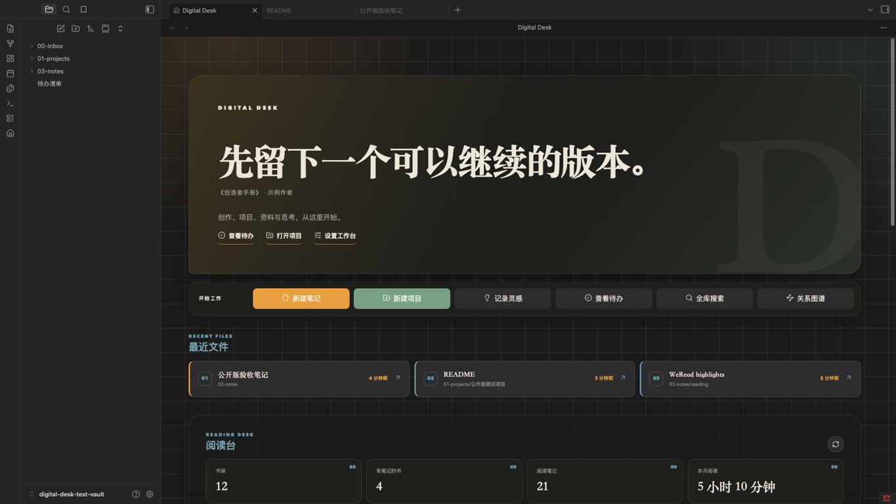

# Digital Desk

Digital Desk turns a vault into a calm, editorial home workspace. Create notes and nested projects, reopen recent files, keep active work visible, and optionally bring your WeRead shelf and personal highlights back into local Markdown.



## What it does

- Opens a dedicated dashboard when Obsidian starts.
- Creates notes in a searchable folder picker ranked by your own usage.
- Creates project folders under any parent folder, with a ready-to-use project note.
- Captures ideas into a configurable inbox.
- Shows recently opened notes with native right-click actions, including rename and trash.
- Discovers active projects or lets you pin exact project paths.
- Reads unfinished Markdown tasks from a file you choose.
- Offers quick links to files and folders in your vault.
- Optionally syncs your WeRead shelf, reading statistics, and personal highlights.
- Archives WeRead highlights to a local Markdown file with stable block links.

The core dashboard has no required community-plugin dependencies.

## Getting started

Digital Desk requires Obsidian 1.13.0 or later.

1. Install and enable Digital Desk.
2. Complete the built-in setup guide and confirm your inbox, project, note, idea, task, and reading-highlight paths.
3. Run **Digital Desk: Open dashboard** or select the home icon in the ribbon.

The initializer creates missing folders and starter files. Existing files and folders remain in place.

## Install from Obsidian

After the plugin is accepted into the Community directory:

1. Open **Settings → Community plugins → Browse**.
2. Search for **Digital Desk**.
3. Select **Install**, then **Enable**.

## WeRead integration

WeRead is optional. The dashboard remains available when the integration is disabled.

To enable it:

1. Get a personal API key from [WeRead Skills](https://weread.qq.com/r/weread-skills).
2. Enter it in the Digital Desk settings.
3. Open the dashboard and select the refresh icon in the Reading Desk section.

The key is stored through Obsidian `SecretStorage`. It is never written to a note or included in plugin logs.

Digital Desk connects to `https://i.weread.qq.com/api/agent/gateway` and to WeRead/Tencent image hosts for book covers. The API key is bound to the user's WeRead identity. Shelf metadata, reading statistics, notebooks, and personal highlight text are requested to render the dashboard. Synced highlight text and a cache are stored inside the user's vault. No developer-operated server or client-side telemetry is used.

The WeRead integration follows Tencent's public [WeChatReading Skills](https://github.com/Tencent/WeChatReading) protocol, currently version `1.0.4`. That project is licensed under Apache-2.0. Digital Desk is an independent community project and is not affiliated with Tencent or WeRead.

## Privacy and file access

Digital Desk works locally inside the current vault. It reads file paths, recently opened files, modification times, the configured task file, and configured project directories. File changes come from actions you choose in the dashboard or settings. When WeRead is enabled, opening the dashboard may refresh an expired local cache and update the managed region of the configured highlight file.

When WeRead is enabled, the plugin uses the network as described above. It does not include analytics, advertisements, or telemetry.

## Manual installation

Download `main.js`, `manifest.json`, and `styles.css` from the latest release, then place them in:

```text
<your-vault>/.obsidian/plugins/digital-desk/
```

Reload Obsidian and enable **Digital Desk** under Community plugins.

## Development

```bash
npm install
npm run build
npm test
```

Develop against a separate test vault. The production bundle is emitted as `main.js`.

## Support

Please use [GitHub Issues](https://github.com/zhangkaiming2579-dev/digital-desk/issues) for reproducible bug reports and feature requests. Never include vault content or API keys in an issue.

## License

[MIT](LICENSE)

---

## 中文说明

Digital Desk 是一个面向创作者的 Obsidian 首页工作台。安装一个插件即可获得新建笔记、新建多级项目、灵感记录、最近文件、项目入口、待办和可选的微信读书阅读台。

首次启用后，跟随内置向导选择自己的目录并建立工作台。插件会补充缺失目录和起始文件，并保留现有内容。更多选项位于 **设置 → 第三方插件 → Digital Desk**。

要求 Obsidian 1.13.0 或更高版本。插件进入社区目录后，可以在 **设置 → 第三方插件 → 浏览** 中搜索 **Digital Desk** 并安装。

微信读书属于可选功能。启用后，插件会访问腾讯微信读书接口，读取书架、阅读统计与个人划线，并把划线写入你指定的 Markdown 文件。密钥保存在 Obsidian 的安全密钥存储中；项目本身没有中转服务器、广告或遥测。
